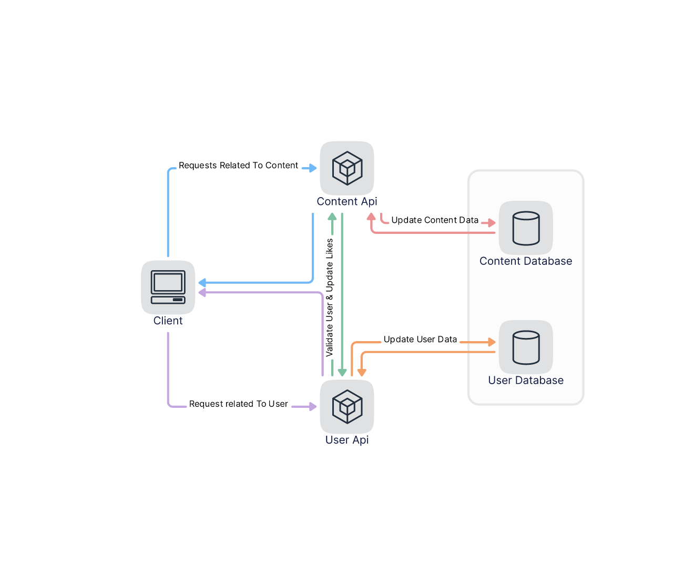

# Pratilipi Full Stack Assignment

## Run Locally
```bash
git clone https://github.com/adityameharia/pratilipi
```

Go to the project directory and run 
```bash
docker-compose -f pratilipi.yaml up
```

## Architecture Diagram


## Frontend

- The frontend can be viewed at 
```bash
http://localhost/
```

## Documentation

- ### Swagger Docs
    After starting the containers the swagger docs would be available at
    ```bash
    http://localhost:8000/swagger/index.html
    http://localhost:8001/swagger/index.html  
    ```
- ### Postman Collection
    The postman collection can be viewed [here](https://www.postman.com/collections/423fe3ecb6201513edc4)
- ### Postman Documentation
    The postman documentation can be viewed [here](https://documenter.getpostman.com/view/10792507/UVeJL59k)

## DataBase Schema

- ### ContentApi Database
    A document in the contentApi's database is an object of
    ```js
    {
        id // The auto generated id
        title // The title of the book
        story // The story 
        date // The date on which on which the story was published in ISO 8601 format
        likes // The number of likes the book has
    }
    ```

- ### UserApi Database
    A document in the userApi's database is an object of
    ```js
    {
        id // The auto generated id
        email // The email provided by the user during signup
        password // The hash of the password provided by the user during signup
        liked // An array of containing the ids of the book the user has liked
    }
    ```

## MongoDB UI
- After running the compose file, mongo-express, a visual representation of the database can be accessed with `user:admin` and `password:admin123` at
```bash
http://localhost:8081/
```